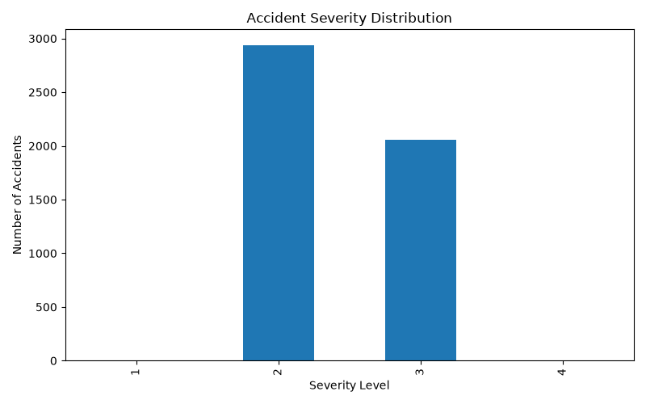
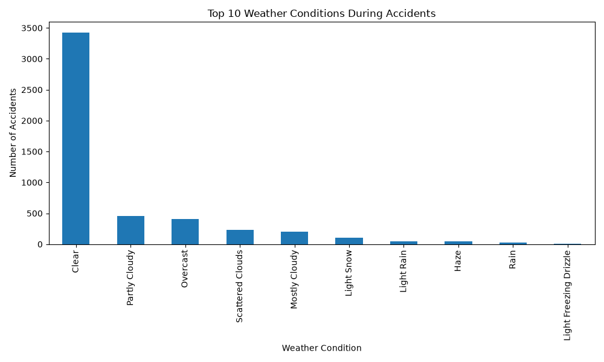
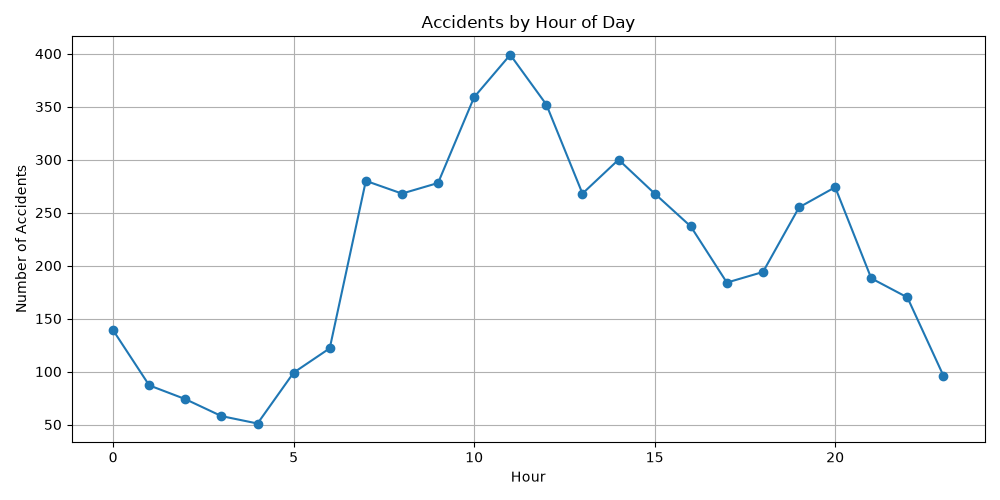
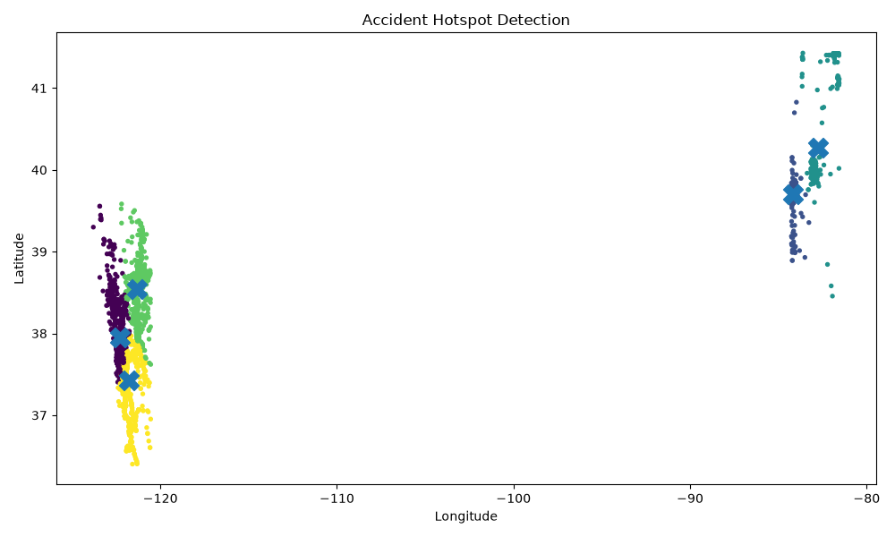

# 🚦 AI-Powered Traffic Accident Analysis Dashboard

An end-to-end **Data Analytics and Machine Learning project** that analyzes large-scale traffic accident data to uncover patterns, identify accident hotspots, and provide actionable insights through visualizations and AI techniques.


## 🎯 Project Objectives

* Analyze large-scale traffic accident datasets.
* Identify accident severity patterns.
* Study the impact of weather conditions on accidents.
* Analyze accident occurrence by time of day.
* Detect accident-prone regions using Machine Learning.
* Build an interactive AI-powered analytics dashboard.

## 📸 Project Visualizations

### 📊 Accident Severity Distribution



### 🌦️ Weather Conditions Analysis



### ⏰ Accidents by Hour of Day



### 📍 AI-Based Accident Hotspot Detection




## 📌 Project Overview

This project uses the **US Accidents Dataset (2016–2023)** to analyze accident severity, weather conditions, time-based trends, and geographic hotspots. Machine learning techniques are applied to detect high-risk accident zones.

## ✨ Features

* 📊 Accident Severity Analysis
* 🌦️ Weather Condition Analysis
* ⏰ Time-Based Accident Trends
* 📍 Accident Hotspot Detection using K-Means Clustering
* 📈 Data Visualization and Insights
* 🤖 Machine Learning-Based Risk Zone Identification


## 🛠️ Tech Stack

* Python
* Pandas
* NumPy
* Matplotlib
* Seaborn
* Scikit-Learn
* Git & GitHub

## 📂 Project Structure

```text
AI-Traffic-Accident-Dashboard/
│
├── data/
├── notebooks/
│   ├── 01_data_exploration.py
│   ├── 02_hotspot_detection.py
│   └── 03_hotspot_visualization.py
│
├── screenshots/
├── README.md
└── LICENSE
```

## 📊 Analysis Completed

### Accident Severity Distribution

* Severity 2 accidents dominate the dataset.
* Severe accidents are comparatively rare.

### Weather Analysis

* Most accidents occurred during clear weather conditions.
* Traffic density appears to influence accident frequency more than adverse weather.

### Time Analysis

* Accident frequency peaks during daytime hours.
* Highest accident occurrence observed around late morning hours.

### Machine Learning Hotspot Detection

* Applied K-Means clustering to identify accident-prone geographic regions.
* Successfully detected multiple accident hotspot clusters.

## 🚀 Future Enhancements

* Interactive Streamlit Dashboard
* Real-time Traffic Risk Prediction
* Accident Severity Prediction Model
* Interactive Geospatial Maps
* AI-based Risk Scoring System

## 👩‍💻 Author

**Priyanka G**
B.E. Electronics and Communication Engineering
Passionate about AI, Data Analytics, Embedded Systems, and Software Development.
